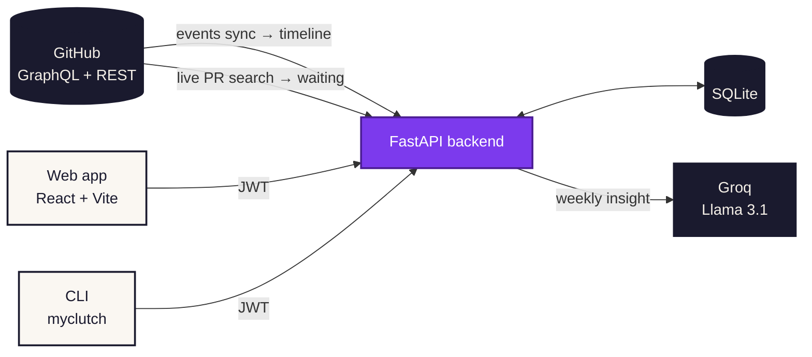

<div align="center">

<a href="https://clutch-woad.vercel.app">
  
</a>

<br/>
<br/>

[](https://clutch-woad.vercel.app)
[](https://pypi.org/project/myclutch/)
[](./LICENSE)

**[Live app](https://clutch-woad.vercel.app)** &nbsp;·&nbsp;
**[CLI on PyPI](https://pypi.org/project/myclutch/)** &nbsp;·&nbsp;
**[API docs](https://clutch-api.onrender.com/docs)** &nbsp;·&nbsp;
**[Discussions](https://github.com/laypatel13/clutch/discussions)** &nbsp;·&nbsp;
**[Contribute](./CONTRIBUTING.md)**

</div>

<br/>

## GitHub tracks your work. Clutch tracks you.

GitHub is great at storing everything you did and terrible at telling you what it means for *today*. Clutch connects to your GitHub account and answers the three questions you actually open it for:

<table>
<tr>
<td width="33%" valign="top">

### What did I do?
**Today** turns your GitHub events into a readable daily timeline: pushes, pull requests, reviews and merges, grouped by day in your own timezone.

</td>
<td width="33%" valign="top">

### What's waiting on me?
**Waiting** checks GitHub live for review requests, approved PRs you can merge, changes you still owe, and PRs that have gone quiet, then lists what you merged in the last 30 days.

</td>
<td width="33%" valign="top">

### Am I consistent?
**Streaks** show your current run and your best. A streak stays alive until the day is over, so it doesn't reset just because you haven't committed *yet*.

</td>
</tr>
</table>

<br/>

## Features

<table>
<tr><td width="24%"><b>Daily timeline</b></td><td>Events synced from GitHub and collapsed into one line per thing you did, newest first, paging back through your history.</td></tr>
<tr><td><b>Waiting on you</b></td><td>Every open loop sorted by urgency. Overdue reviews are flagged, and approved PRs you can't merge are kept apart from the ones you can.</td></tr>
<tr><td><b>Recently merged</b></td><td>Your pull requests merged in the last 30 days, so closed loops don't vanish.</td></tr>
<tr><td><b>Streaks and heatmap</b></td><td>Current and longest contribution streak, plus a 12-month heatmap in the terminal.</td></tr>
<tr><td><b>AI weekly insight</b></td><td>A short read on your week and your coding patterns, generated with Llama 3.1 on Groq.</td></tr>
<tr><td><b>Public profile</b></td><td>A shareable page at <code>/u/&lt;username&gt;</code>.</td></tr>
<tr><td><b>Terminal first</b></td><td>Streaks, stats, heatmap, patterns and insights from your shell with <code>pip install myclutch</code>.</td></tr>
<tr><td><b>Light and dark</b></td><td>A hand-built neo-brutalist design system with hard shadows and paper texture, built with keyboard and screen-reader users in mind.</td></tr>
</table>

<br/>

## In your terminal

<div align="center">
  
</div>

<br/>

Install the CLI:

```bash
pip install myclutch
```

Sign in. This opens GitHub in your browser, then hands the token back to the terminal:

```bash
clutch login
```

Check your streak:

```bash
clutch streak
```

| Command | What it does |
|:--|:--|
| `clutch login` / `logout` / `whoami` | Sign in with GitHub, sign out, show who's signed in |
| `clutch streak` | Current and longest streak, with progress toward your best |
| `clutch stats --days 30` | Activity totals for the last N days |
| `clutch heatmap --weeks 12` | Contribution heatmap for the last N weeks |
| `clutch patterns` | Your most productive days and habits |
| `clutch insight` | AI-generated weekly insight |
| `clutch repos` / `clutch lang` | Recently active repositories and language breakdown |
| `clutch status` | Sign-in status and API health |

To point the CLI at a local backend, set `CLUTCH_API_URL=http://localhost:8000` before `clutch login`.

<br/>

## How it works



- **Timeline:** GitHub events are synced into the database and collapsed into readable entries, so Today reads from local data and can load earlier days on demand.
- **Waiting:** asked live from GitHub on every request in one GraphQL query, because a stale "waiting on you" list is worse than none.
- **Auth:** GitHub OAuth 2.0 issues a JWT that the web app and the CLI share.


<br/>

## Built with

<p>
  
  
  
  
  
  
  
  
  
</p>

No CSS framework: the web app runs on its own token-based design system (`frontend/src/styles/index.css`), with League Spartan, Poppins and JetBrains Mono.

<br/>

## Run it locally

**You'll need** Python 3.11+, Node.js 20.19+, a [GitHub OAuth app](https://github.com/settings/developers), and optionally a [Groq API key](https://console.groq.com) for AI insights.

### 1. Create a GitHub OAuth app

| Field | Value |
|:--|:--|
| Homepage URL | `http://localhost:5173` |
| Authorization callback URL | `http://localhost:8000/auth/github/callback` |

Keep the **Client ID** and generate a **Client Secret**.

### 2. Start the backend

From the repository root, go to the backend:

```bash
cd backend
```

Create a virtual environment:

```bash
python -m venv venv
```

Activate it on macOS or Linux:

```bash
source venv/bin/activate
```

Or on Windows:

```bash
venv\Scripts\activate
```

Install the dependencies:

```bash
pip install -r requirements.txt
```

Create your environment file:

```bash
cp .env.example .env
```

Then fill in these values in `backend/.env`:

| Variable | Example |
|:--|:--|
| `DATABASE_URL` | `sqlite:///./clutch.db` |
| `SECRET_KEY` | any long random string |
| `GITHUB_CLIENT_ID` / `GITHUB_CLIENT_SECRET` | from your OAuth app |
| `GITHUB_REDIRECT_URI` | `http://localhost:8000/auth/github/callback` |
| `FRONTEND_URL` | `http://localhost:5173` |
| `GROQ_API_KEY` | optional; add it to enable AI insights |

Start the API:

```bash
uvicorn app.main:app --reload
```

The API runs at `http://localhost:8000`, with interactive docs at [`/docs`](http://localhost:8000/docs).

### 3. Start the frontend

In a new terminal, from the repository root, go to the frontend:

```bash
cd frontend
```

Install the dependencies:

```bash
npm install
```

Point the app at your local API:

```bash
echo "VITE_API_URL=http://localhost:8000" > .env
```

Start the dev server:

```bash
npm run dev
```

Open `http://localhost:5173` and sign in with GitHub.

### 4. Run the tests

Backend tests, from `backend/` with the virtual environment active:

```bash
pytest
```

Frontend build and lint, from `frontend/`:

```bash
npm run build
```

```bash
npm run lint
```

<br/>

## API endpoints

| Method | Endpoint | Description |
|:--|:--|:--|
| `GET` | `/auth/github` | Start the GitHub OAuth flow |
| `GET` | `/auth/github/callback` | Finish OAuth and issue a JWT |
| `GET` | `/users/me` | The signed-in user |
| `GET` | `/users/{username}` | A public profile |
| `GET` | `/github/timeline` | One page of the activity timeline (`cursor`, `limit`) |
| `POST` | `/github/events/sync` | Fetch new GitHub events into the timeline |
| `GET` | `/github/waiting` | Open PR loops and recent merges, checked live |
| `GET` | `/github/streak` | Current and longest streak, and whether today counts yet |
| `GET` | `/github/heatmap` | 12-month contribution heatmap |
| `GET` | `/github/activity` | Daily activity for the last N days |
| `GET` | `/github/languages` | Language breakdown across repositories |
| `GET` | `/github/repos` | Recently updated repositories |
| `POST` | `/github/sync` | Sync daily activity to the database |
| `POST` | `/github/pulls/sync` | Sync pull requests to the database |
| `GET` | `/insights/weekly` | AI weekly insight |
| `GET` | `/insights/summary` | One-line AI summary |
| `GET` | `/insights/patterns` | Detected coding patterns |
| `GET` | `/health`, `/ready` | Liveness and database readiness |

<br/>

## Project structure

```text
clutch/
├── backend/                  FastAPI service
│   ├── app/
│   │   ├── main.py           app, CORS, routers, health checks
│   │   ├── configuration.py  settings from .env
│   │   ├── dependencies.py   JWT auth and the GitHub client
│   │   ├── models/           users, activity, events, pull requests, insights
│   │   ├── routers/          auth, github, users, insights
│   │   └── services/         activity sync, timeline, waiting, GitHub, AI insights
│   └── tests/
├── frontend/                 React + TypeScript web app
│   ├── public/               favicon, icons, paper textures
│   └── src/
│       ├── pages/            Landing, Today, Waiting, public profile
│       ├── components/       timeline, waiting, layout, shared UI
│       ├── hooks/ contexts/  data fetching and auth state
│       └── styles/index.css  the design system
├── cli/                      the myclutch package (Typer + Rich)
│   └── clutch_cli/           auth, activity, repositories, insights, system
└── docs/readme/              illustrations for this README
```

<br/>

## Contributing

Start with a **[Discussion](https://github.com/laypatel13/clutch/discussions)** for questions, bugs or ideas. Accepted ones become issues, and pull requests are welcome for issues you've been assigned. See **[CONTRIBUTING.md](./CONTRIBUTING.md)**.

<br/>

<div align="center">


**Clutch** is open source under the [MIT License](./LICENSE).<br/>
Made by [Lay Patel](https://github.com/laypatel13).

</div>
