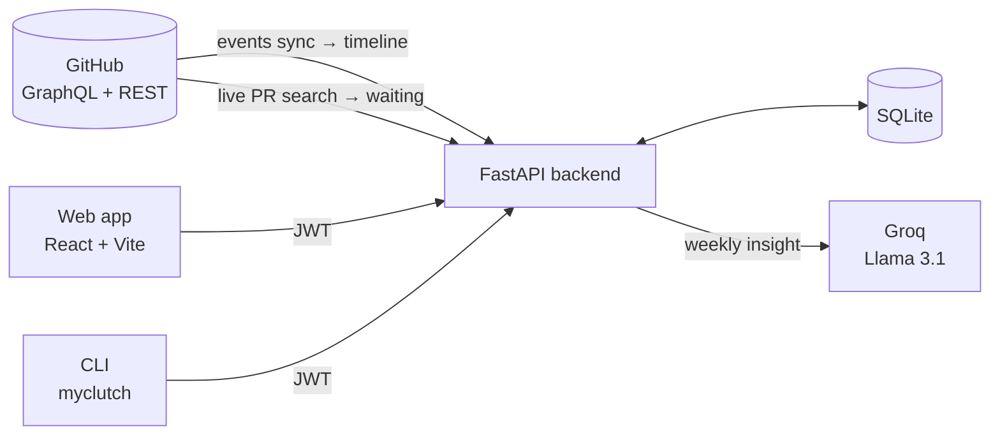

# Clutch

**GitHub tracks your work. Clutch tracks you.**

[](https://pypi.org/project/myclutch/)
[](./LICENSE)

GitHub is great at storing everything you did and terrible at telling you what it means for *today*. Clutch connects to your GitHub account and answers the three questions you actually open it for.

[Live app](https://clutch-woad.vercel.app) &nbsp;·&nbsp; [CLI on PyPI](https://pypi.org/project/myclutch/) &nbsp;·&nbsp; [API docs](https://clutch-api-7lw4.onrender.com/docs) &nbsp;·&nbsp; [Discussions](https://github.com/laypatel13/clutch/discussions)

## What did I do?

**Today** turns your GitHub events into a readable daily timeline: pushes, pull requests, reviews and merges, grouped by day in your own timezone, paging back through your history.

## What's waiting on me?

**Waiting** checks GitHub live for review requests, approved pull requests you can merge, changes you still owe, and pull requests that have gone quiet. Everything is sorted by urgency, overdue reviews are flagged, and approved pull requests you can't merge are kept apart from the ones you can. Below that it lists what you merged in the last 30 days, so closed loops don't vanish.

## Am I consistent?

**Streaks** show your current run and your best, with a contribution heatmap. A streak stays alive until the day is over, so it doesn't reset just because you haven't committed *yet*.

## Features

| Feature | What it does |
|:--|:--|
| Daily timeline | Events synced from GitHub and collapsed into one line per thing you did, newest first. |
| Waiting on you | Every open pull request loop sorted by urgency, with overdue reviews flagged. |
| Recently merged | Your pull requests merged in the last 30 days. |
| Streaks and heatmap | Current and longest contribution streak, plus a contribution heatmap. |
| AI weekly insight | A short read on your week and your coding patterns, generated with Llama 3.1 on Groq. |
| Public profile | A shareable page at `/u/<username>`, off by default. |
| Terminal first | Streaks, stats, heatmap, patterns and insights from your shell. |
| Light and dark | A hand-built neo-brutalist design system, built with keyboard and screen-reader users in mind. |

## Try it

Open the [hosted app](https://clutch-woad.vercel.app) and sign in with GitHub, or work from your terminal:

```bash
pip install myclutch
```

Then sign in:

```bash
clutch login
```

The full command reference is in [cli/README.md](./cli/README.md).

## How it works



- **Timeline:** GitHub events are synced into the database and collapsed into readable entries, so Today reads from local data and can load earlier days on demand.
- **Waiting:** asked live from GitHub on every request in one GraphQL query, because a stale "waiting on you" list is worse than none.
- **Auth:** GitHub OAuth 2.0 issues a JWT that the web app and the CLI share.

## Built with

React and TypeScript on Vite, FastAPI and SQLAlchemy on SQLite, Llama 3.1 on Groq, and a Typer and Rich command line. No CSS framework: the web app runs on its own token-based design system (`frontend/src/styles/index.css`), with League Spartan, Poppins and JetBrains Mono.

## Documentation

| Document | What's in it |
|:--|:--|
| [cli/README.md](./cli/README.md) | The `myclutch` command line: install, every command, the login flow and configuration. |
| [docs/api.md](./docs/api.md) | The REST API: authentication and every endpoint. |
| [docs/development.md](./docs/development.md) | Running Clutch locally: backend, frontend, tests and project structure. |
| [CONTRIBUTING.md](./CONTRIBUTING.md) | How changes are proposed, reviewed and merged. |

## Contributing

Start with a [Discussion](https://github.com/laypatel13/clutch/discussions) for questions, bugs or ideas. Accepted ones become issues, and pull requests are welcome for issues you've been assigned. See [CONTRIBUTING.md](./CONTRIBUTING.md).

---

Clutch is open source under the [MIT License](./LICENSE). Made by [Lay Patel](https://github.com/laypatel13).
