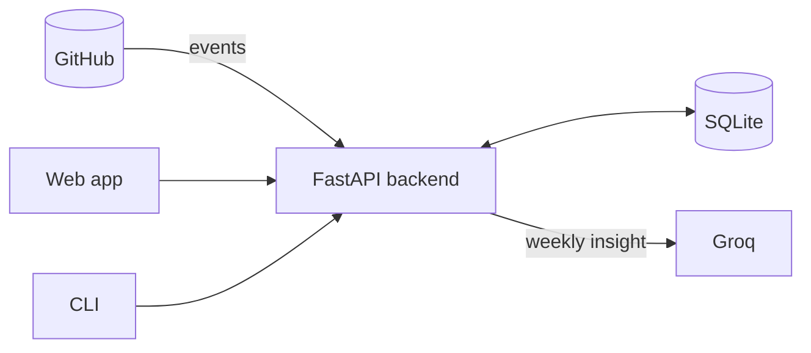

# Clutch

**GitHub tracks your work. Clutch tracks you.**

[](https://github.com/laypatel13/clutch/actions/workflows/ci.yml)
[](https://pypi.org/project/myclutch/)
[](./LICENSE)

Clutch connects to your GitHub account and answers three questions: what did I do, what's waiting on me, and am I consistent?

[Live app](https://clutch-woad.vercel.app) · [CLI on PyPI](https://pypi.org/project/myclutch/) · [API docs](https://clutch-api-7lw4.onrender.com/docs) · [Discussions](https://github.com/laypatel13/clutch/discussions)

## What it does

- **Today** turns your GitHub events into a daily timeline of pushes, pull requests, reviews and merges, grouped by day in your own timezone.
- **Waiting** lists the pull requests that need something from you, sorted by urgency: reviews you've been asked for, approved pull requests you can merge, changes you still owe, and ones that have gone quiet. It also shows what you merged in the last 30 days.
- **Streaks** show your current and longest streak with a contribution heatmap. A streak stays alive until the day is over, so it doesn't reset just because you haven't committed yet.

Clutch also has an AI weekly insight (Llama 3.1 on Groq), a shareable profile page at `/u/<username>`, light and dark themes, and a command line for all of it.

## Try it

Open the [live app](https://clutch-woad.vercel.app) and sign in with GitHub.

Or use the command line. Install it:

```bash
pip install myclutch
```

Then sign in:

```bash
clutch login
```

Every command is listed in [cli/README.md](./cli/README.md).

## How it works


```mermaid
flowchart LR
    GH[("GitHub")]
    API["FastAPI backend"]
    DB[("SQLite")]
    AI["Groq"]
    WEB["Web app"]
    CLI["CLI"]

    GH -- "events" --> API
    API <--> DB
    API -- "weekly insight" --> AI
    WEB --> API
    CLI --> API
```

- The **timeline** is built from GitHub events saved in the database, so it loads fast and can page back through your history.
- **Waiting** and your **stats** are asked from GitHub live on every request, so they're always current.
- **Sign-in** uses GitHub OAuth. The web app and the CLI share the same login token.

Built with React, TypeScript and Vite on the frontend, FastAPI and SQLAlchemy on the backend, and Typer and Rich for the CLI.

## Documentation

| Document | What's in it |
|:--|:--|
| [cli/README.md](./cli/README.md) | Installing the CLI and every command |
| [docs/API.md](./docs/API.md) | The REST API and its endpoints |
| [docs/DEVELOPMENT.md](./docs/DEVELOPMENT.md) | Running Clutch on your own machine |
| [CONTRIBUTING.md](./CONTRIBUTING.md) | How to propose and make a change |

## Contributing

Questions, bugs and ideas start in [Discussions](https://github.com/laypatel13/clutch/discussions). See [CONTRIBUTING.md](./CONTRIBUTING.md) for how changes are made.

## License

[MIT](./LICENSE), made by [Lay Patel](https://github.com/laypatel13).
